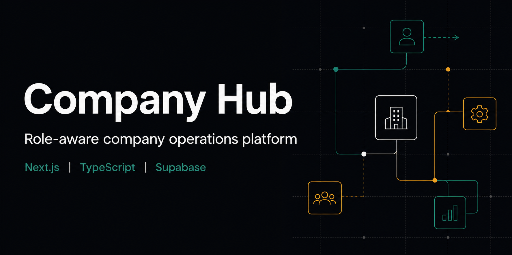
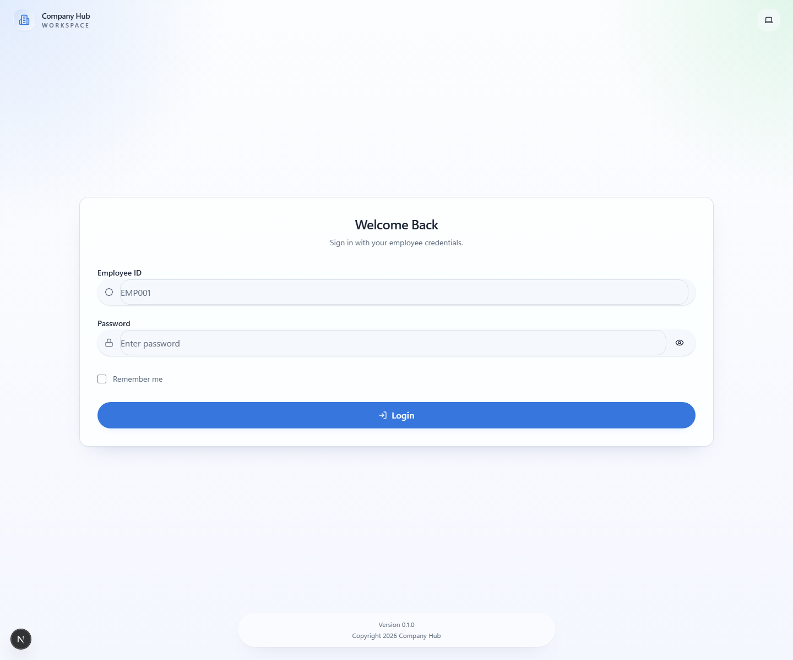
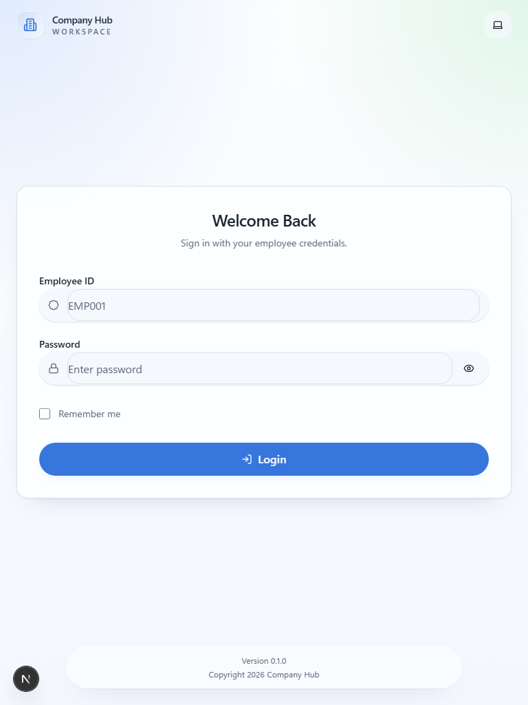
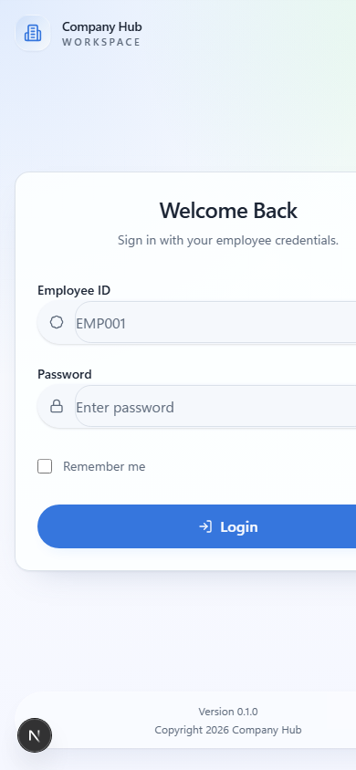
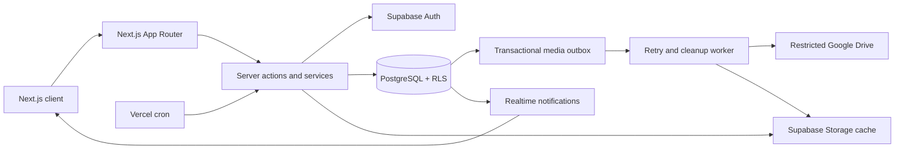

# Company Hub

Role-aware company operations software for employee self-service, workforce administration, and platform governance.



[](PROJECT_STATE.md)
[](CHANGELOG.md)
[](#technology-stack)
[](#technology-stack)
[](#architecture)

[Live application](https://company-hub-zeta.vercel.app) | [Architecture](ARCHITECTURE.md) | [Product vision](PRODUCT_VISION_2027.md) | [Milestones](PROJECT_STATUS.md) | [Technical state](PROJECT_STATE.md)

Public application routes are `/` (product homepage), `/privacy` (Privacy Policy), and `/terms` (Terms of Service). The employee workspace remains behind `/login` and the existing protected route boundaries.



## Overview

Company Hub brings common internal operations into one application. Employees can manage attendance, leave, announcements, calendars, and shared resources. Company administrators manage people, policies, roles, locations, and company settings. A separately authorized platform control center manages company lifecycle, feature availability, releases, and system health.

The project is designed around explicit tenant boundaries and role-based access. Supabase provides authentication, PostgreSQL data storage, Row Level Security, realtime notifications, and file storage; Next.js provides the application and server-side control plane.

## Implemented Capabilities

- Employee authentication, profile management, and password recovery
- GPS-aware attendance, work-mode policies, working hours, and reporting
- Isolated-QA Phase 5 tracking core and authenticated bounded location
  ingestion; production collection and tracking UI remain inactive
- Isolated Flutter Android client with provisional QA/production flavors,
  Keystore-backed bearer sessions, authoritative attendance reconciliation,
  fail-closed public environment contracts, and a QA-validated native
  foreground-service/permission foundation plus native observation and bounded
  encrypted ingestion; production collection remains inactive
- Durable attendance selfie delivery to restricted Google Drive, with private
  Supabase Storage retained as a verified three-day recovery cache
- Leave types, balances, requests, approvals, and employee self-service
- Employee directory, import/export, hierarchy, roles, and permissions
- Announcements, celebrations, company calendar, and realtime notifications
- Resource library with categories, visibility rules, and file storage
- Company branding, locations, attendance policy, and feature settings
- System-admin company lifecycle, feature control, releases, schema health, and maintenance state
- Responsive layouts, theme support, offline status, and PWA foundations

Durable Google Sheets synchronization projects the governed Holidays dataset from Supabase through a leased outbox worker with idempotent batched writes, retry recovery, reconciliation, and actionable failure alerts.

See [FEATURES.md](FEATURES.md) for the detailed implementation map and [KNOWN_ISSUES.md](KNOWN_ISSUES.md) for current limitations.

Product Phase 5 live location is implemented through bounded native ingestion
in QA/local development. Its database, distributed abuse protection, Flutter
shell, mobile attendance, permission/disclosure service, Android
`LocationManager` observation, encrypted queue, and idempotent delivery
foundations are complete; production activation and Admin presentation remain
inactive. The duty-bound privacy contract and native-background versus
foreground-only web decision are documented in
[the feature specification](docs/LIVE_LOCATION_TRACKING.md).

The employee Flutter shell lives at
[`clients/employee_android`](clients/employee_android/README.md). It remains
isolated from the permanent Admin web application and contains no authentication,
attendance, or location business rules. It now includes QA-only permission,
foreground-service lifecycle, framework fused/GPS observation, and bounded
Keystore-encrypted ingestion, but no background-location permission.

## Screenshots

| Desktop                                                        | Tablet                                                       | Mobile                                                       |
| -------------------------------------------------------------- | ------------------------------------------------------------ | ------------------------------------------------------------ |
|  |  |  |

Additional before-and-after UI regression captures are stored in [`docs/screenshots`](docs/screenshots).

## Architecture



The codebase follows feature-oriented modules. Pages compose feature services, repositories, actions, and UI components; database migrations define the security and business-data contracts. Global platform access is provisioned explicitly and is not inherited from company-admin access.

For design decisions and boundaries, read [ARCHITECTURE.md](ARCHITECTURE.md), [DATABASE.md](DATABASE.md), [AUTH.md](AUTH.md), and [DECISIONS.md](DECISIONS.md).

## Technology Stack

| Layer                 | Technology                                   |
| --------------------- | -------------------------------------------- |
| Application           | Next.js 15, React 19, TypeScript             |
| Styling               | Tailwind CSS, Radix UI primitives            |
| Backend               | Supabase Auth, PostgreSQL, Realtime, Storage |
| Derived integrations  | Google Drive; durable Google Sheets Holidays |
| Validation and import | TypeScript services, SheetJS                 |
| Testing               | ESLint, TypeScript, Playwright, axe-core     |
| Delivery              | Vercel, GitHub Actions, Supabase CLI         |

## Local Development

### Prerequisites

- Node.js 24.x
- npm 11.x
- A Supabase project for local or test use
- Supabase CLI when applying migrations locally

### Setup

```powershell
git clone https://github.com/itsmebillah/company-hub.git
Set-Location company-hub
npm ci
npm run setup:local -- --source E:\secure\company-hub.env
npm run doctor
npm run dev
```

The setup helper imports only the repository's allowlisted configuration into
the Git-ignored `.env.development.local`, preserves valid existing values, and
never displays secrets. It can instead decrypt an external SOPS bundle with
`--sops`; the encrypted bundle and its age/KMS unlock credential remain outside
Git. `doctor` reports `CONFIGURED`, `MISSING`, or `INVALID` and performs a live,
least-privilege Google credential check without starting OAuth. See
[Portable Local Setup](docs/LOCAL_SETUP.md) for migration, recovery, and secret
ownership instructions.

Use a development Supabase project and never expose the service-role key to browser code.

Open `http://localhost:3000`. First-time environments use the bootstrap setup flow described in [DEVELOPMENT.md](DEVELOPMENT.md).

## Database Setup

Migrations in [`supabase/migrations`](supabase/migrations) define the schema, policies, functions, storage rules, notification foundations, and platform-control capabilities. Apply them in numeric order to a clean development project.

```powershell
npx supabase link --project-ref <project-ref>
npx supabase db push
```

Review [DATABASE.md](DATABASE.md) and [SECURITY.md](SECURITY.md) before connecting the application to any environment containing real employee data.

## Verification

```powershell
npm run lint
npm run typecheck
npm run build
npm run test:e2e
```

Lint and TypeScript checks pass on the audited revision. A production build also compiles successfully; static page generation requires the Supabase variables from `.env.example`. End-to-end tests require an isolated configured environment and the test identities documented in [TESTING.md](TESTING.md).

## Project Structure

```text
app/                 Routes, layouts, server endpoints, and route groups
components/          Shared layout and UI components
features/            Domain modules with actions, services, repositories, and UI
lib/                 Auth, Supabase, configuration, navigation, and utilities
supabase/migrations/ Ordered database and security changes
tests/e2e/           Playwright user-flow and accessibility tests
docs/screenshots/    Versioned visual-regression evidence
```

## Deployment

The production path uses Vercel for the Next.js application and Supabase for managed backend services. Releases are gated by code checks, database compatibility, and environment configuration. Follow [DEPLOYMENT.md](DEPLOYMENT.md) and [RELEASE_CHECKLIST.md](RELEASE_CHECKLIST.md); do not infer deployment state from migration files alone.

## Roadmap

Current priorities and deferred work are maintained in [NEXT_SPRINT.md](NEXT_SPRINT.md), [ROADMAP.md](ROADMAP.md), and [BACKLOG.md](BACKLOG.md). Completed changes are recorded in [CHANGELOG.md](CHANGELOG.md).

## Contributing and Security

Read [CONTRIBUTING.md](CONTRIBUTING.md), [CODING_STANDARDS.md](CODING_STANDARDS.md), and [SECURITY.md](SECURITY.md) before proposing changes. Do not include employee data, production credentials, service-role keys, or production database exports in issues or commits.

## License

No open-source license is currently declared. The source is publicly visible, but reuse rights are not granted until a license is added by the repository owner.

---

**Md. Masum Billah** | Data Analyst, Automation Developer, and Business Intelligence Specialist

[Portfolio](https://itsmebillah.github.io/) | [GitHub](https://github.com/itsmebillah) | [Email](mailto:itsmbillah@gmail.com) | [Live Demo](https://company-hub-zeta.vercel.app) | [Documentation](ARCHITECTURE.md) | [Related: Sales Intelligence Platform](https://github.com/itsmebillah/Sales-Dashboard)
